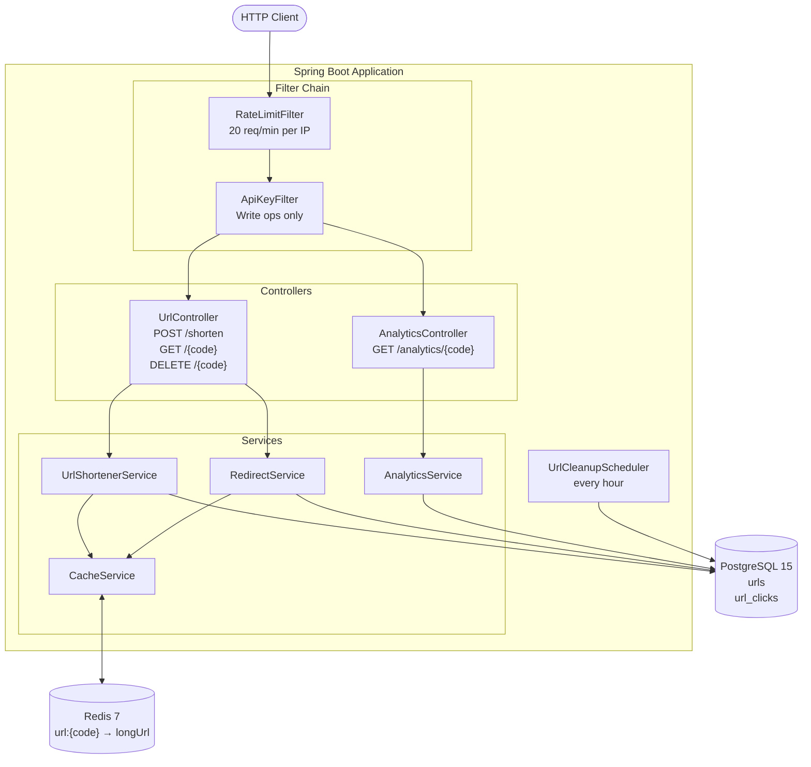
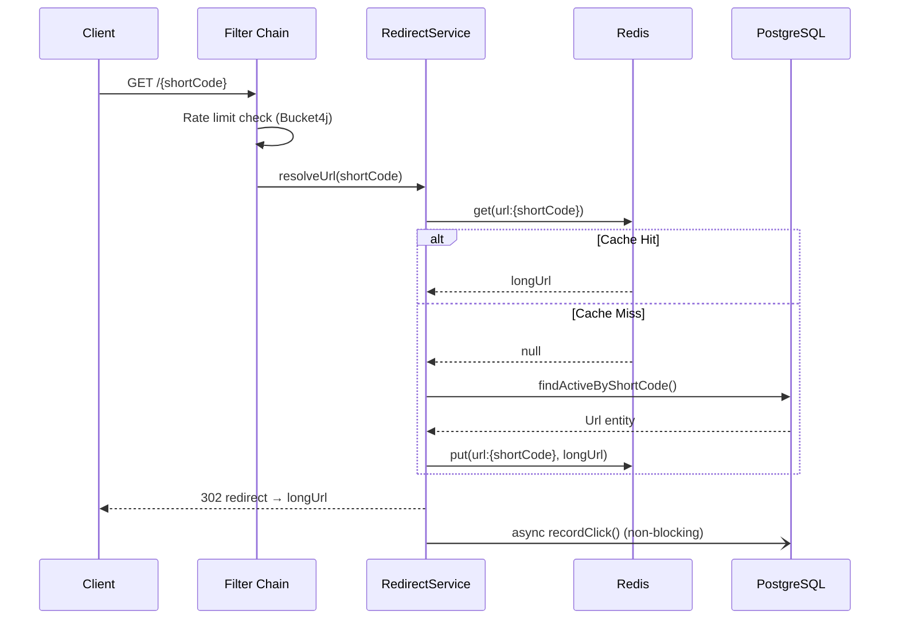

# URL Shortener

A production-grade URL shortening service built with Spring Boot 4, PostgreSQL, and Redis. Supports custom aliases, click analytics, expiring links, rate limiting, and API key authentication.

## Features

- Shorten any HTTP/HTTPS URL with an auto-generated Base62 code or a custom alias
- 302 redirects with Redis cache-first resolution (sub-millisecond on cache hit)
- Per-link click analytics — total, last 24h, last 7 days, top referers
- Configurable link expiry (default 30 days); hourly background cleanup
- Per-IP rate limiting (20 req/min) via Bucket4j
- API key protection on write operations (create, delete)
- Soft deletes — analytics history is preserved after a link is deactivated
- Swagger UI at `/swagger-ui.html`
- Docker Compose setup for one-command local startup

## Architecture

### Component Overview



### Redirect Request Flow



## Tech Stack

| Layer | Technology |
|---|---|
| Framework | Spring Boot 4.0.5 / Java 17 |
| Database | PostgreSQL 15 |
| Cache | Redis 7 |
| Rate Limiting | Bucket4j 8.7 |
| API Docs | SpringDoc OpenAPI 2.8.6 |
| Containerization | Docker + Docker Compose |
| Testing | JUnit 5, Mockito, H2 (in-memory) |

## Getting Started

### Prerequisites

- Docker and Docker Compose

### Run with Docker Compose

```bash
git clone https://github.com/vijay5375/url-shortener.git
cd url-shortener
docker compose up --build
```

The API will be available at `http://localhost:8080`.  
Swagger UI: `http://localhost:8080/swagger-ui.html`

### Run Locally (without Docker)

Requires Java 17, Maven, a running PostgreSQL 15 instance, and a running Redis 7 instance.

```bash
# Configure your database and Redis in src/main/resources/application.yaml
./mvnw spring-boot:run
```

## API Reference

All write endpoints require the `X-API-Key` header. The default key for local development is `change-me-in-production` (set `app.api-key` in `application.yaml`).

---

### POST `/shorten` — Create a short URL

**Headers:** `X-API-Key: <key>`, `Content-Type: application/json`

**Request body:**
```json
{
  "longUrl": "https://example.com/some/very/long/path",
  "customAlias": "my-link",
  "ttlDays": 60
}
```

| Field | Required | Description |
|---|---|---|
| `longUrl` | Yes | Must start with `http://` or `https://` |
| `customAlias` | No | 3–20 chars, alphanumeric + hyphens/underscores |
| `ttlDays` | No | Overrides the default 30-day expiry |

**Response `201 Created`:**
```json
{
  "shortCode": "my-link",
  "shortUrl": "http://localhost:8080/my-link",
  "longUrl": "https://example.com/some/very/long/path",
  "createdAt": "2026-05-24T10:00:00",
  "expiresAt": "2026-07-23T10:00:00"
}
```

---

### GET `/{shortCode}` — Redirect

Resolves the short code and returns a `302 Found` redirect to the original URL. Clicks are recorded asynchronously.

**Response:** `302 Found` with `Location` header set to the original URL.  
Returns `404` if not found, `410 Gone` if expired.

---

### DELETE `/{shortCode}` — Deactivate a URL

**Headers:** `X-API-Key: <key>`

Soft-deletes the link (marks it inactive) and evicts it from the Redis cache. Analytics data is preserved.

**Response:** `204 No Content`

---

### GET `/analytics/{shortCode}` — Click analytics

**Response `200 OK`:**
```json
{
  "shortCode": "my-link",
  "longUrl": "https://example.com/some/very/long/path",
  "totalClicks": 42,
  "clicksLast24h": 5,
  "clicksLast7days": 18,
  "topReferers": ["https://twitter.com", "https://linkedin.com"],
  "createdAt": "2026-05-24T10:00:00",
  "expiresAt": "2026-07-23T10:00:00",
  "active": true
}
```

## Configuration

All settings are in `src/main/resources/application.yaml` and can be overridden via environment variables in Docker.

| Property | Default | Description |
|---|---|---|
| `app.base-url` | `http://localhost:8080` | Used to build the full short URL in responses |
| `app.api-key` | `change-me-in-production` | API key for write operations |
| `app.default-ttl-days` | `30` | Default link expiry in days |
| `app.cache-ttl-seconds` | `3600` | Redis cache TTL (1 hour) |
| `server.port` | `8080` | HTTP port |

## Running Tests

```bash
./mvnw test
```

Tests use an H2 in-memory database and mock the Redis cache — no external services required.

| Test File | Type | Coverage |
|---|---|---|
| `UrlControllerIntegrationTest` | Integration | POST, GET, DELETE — auth, validation, round-trip |
| `AnalyticsControllerIntegrationTest` | Integration | Analytics counts, top referers, 404 |
| `UrlShortenerServiceTest` | Unit | Two-phase save, custom alias, TTL, cache warm |
| `RedirectServiceTest` | Unit | Cache hit/miss, expired (410), inactive (404) |
| `Base62EncoderTest` | Unit | Encode/decode round-trips, boundary values |

## Project Structure

```
src/main/java/com/urlshortener/
├── config/          # AppProperties, RedisConfig
├── controller/      # UrlController, AnalyticsController
├── dto/             # ShortenRequest, ShortenResponse, AnalyticsResponse
├── entity/          # Url, UrlClick (JPA entities)
├── exception/       # Custom exceptions + GlobalExceptionHandler
├── filter/          # RateLimitFilter (Bucket4j), ApiKeyFilter
├── repository/      # UrlRepository, UrlClickRepository (Spring Data JPA)
├── scheduler/       # UrlCleanupScheduler (hourly expiry cleanup)
├── service/         # UrlShortenerService, RedirectService, AnalyticsService, CacheService
└── util/            # Base62Encoder
```

## License

MIT
